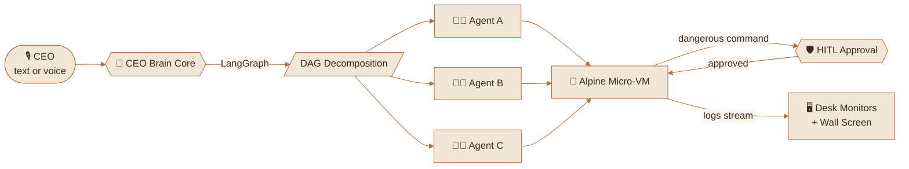
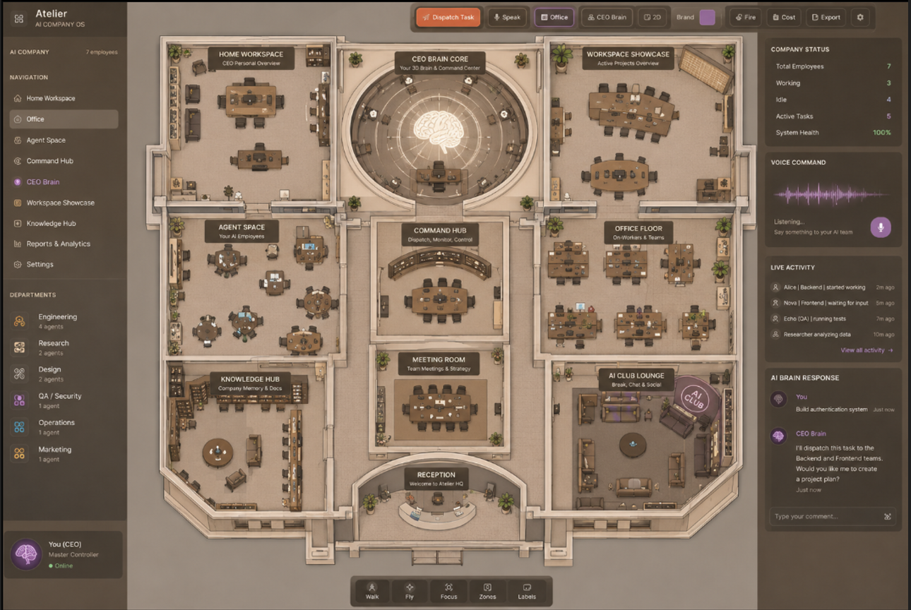
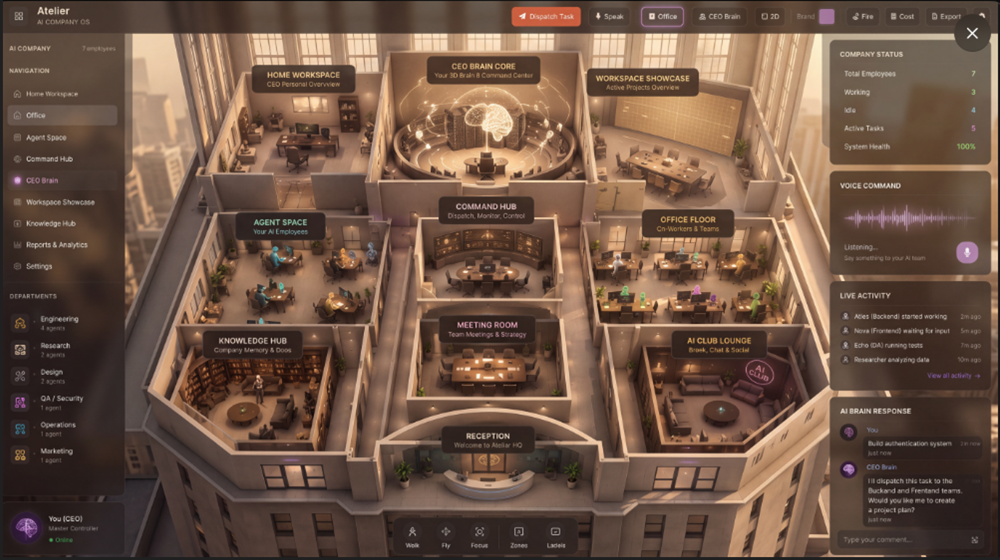
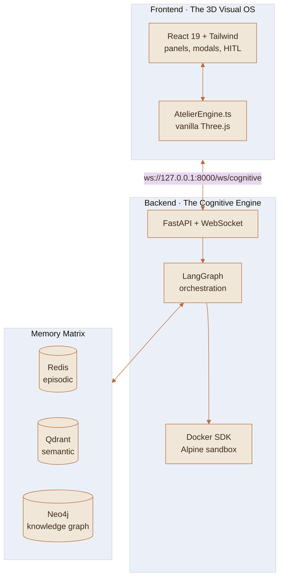
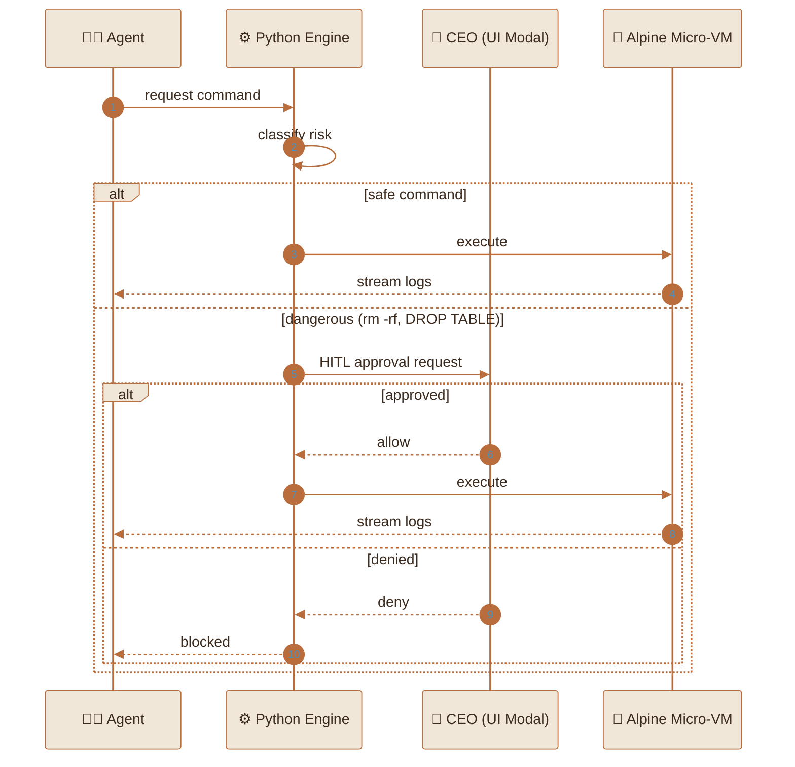
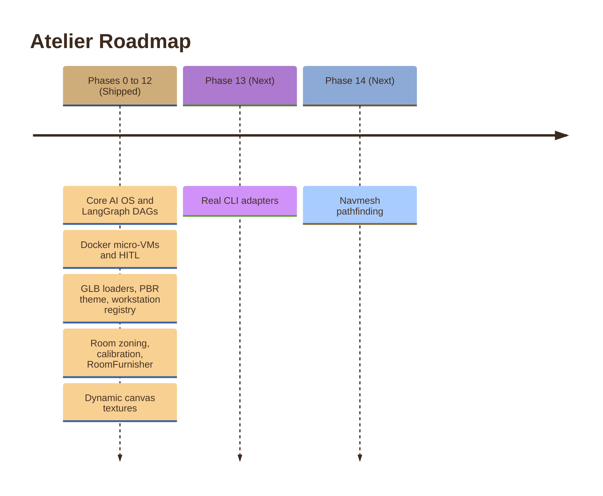

<div align="center">


<a href="https://git.io/typing-svg">
  
</a>

<br/>


<br/>


<br/>


<br/>

**[Overview](#-overview) · [Features](#-core-features) · [Architecture](#-architecture) · [Security](#-security-model) · [Quick Start](#-quick-start) · [Structure](#-project-structure) · [Roadmap](#-roadmap)**

</div>

<br/>

<!--
  DEMO SLOT: record a 10-15s screen capture (CEO dispatches a task -> agents walk -> monitors stream logs)
  and drop it at docs/media/demo.gif, then uncomment below.

<p align="center">
  
</p>
-->

## 🏛️ Overview

Atelier is **not a dashboard**. It is a spatial diorama of a premium AI company headquarters where you act as the CEO.

Give a high-level task to the **CEO Brain Core** in 3D, by keyboard or voice. A Python backend decomposes it into a **Directed Acyclic Graph (DAG)** and routes each step to a human-like 3D AI employee. Employees sit at their desks, type on monitors that stream **real terminal logs**, walk between rooms using pathfinding, and execute code inside **isolated Docker micro-VMs**.

> Watching your agents work should feel like walking through an office, not reading a log file.

<br/>

## ⚡ The Loop



<br/>

## ✨ Core Features

| | Feature | What it does |
|---|---|---|
| 🧠 | **Cognitive Engine** | LangGraph decomposes prompts into stateful, multi-actor DAGs with self-healing topologies. |
| 🏢 | **Cinematic 3D HQ** | Custom GLB architecture with warm PBR materials, dynamic lighting and ACES Filmic tone mapping. |
| 🧑‍💻 | **Living AI Employees** | Agents walk to the Meeting Room, sit at auto-detected GLB workstations and collaborate in holographic bubbles. |
| 🛡️ | **Micro-VM Security (HITL)** | No direct host access. Commands run in isolated Alpine containers; destructive ones need CEO approval. |
| 🖥️ | **Dynamic Canvas Textures** | Desk monitors and the Meeting Room wall stream terminal logs, status and live DAG visualizations. |
| 🗺️ | **Spatial Calibration** | Load any custom 3D office model, click to map waypoints, and get generated coordinate configs. |
| 🎙️ | **Voice Command Interface** | Dispatch tasks through the browser's Web Speech API. |

<br/>

## 🎬 See It In Action

<div align="center">

### 🧭 2D Plan View

<br/><sub>Top-down layout of the HQ: rooms, zones and workstations at a glance.</sub>

<br/><br/>

### 🏢 3D Cinematic View

<br/><sub>The live 3D diorama: PBR materials, lighting and AI employees at their desks.</sub>

</div>

<br/>

## 🏗️ Architecture



### Frontend

| Layer | Choice | Notes |
|---|---|---|
| Core | React 19, TypeScript, Vite, Tailwind CSS | Feature-based architecture |
| 3D | Vanilla Three.js via a custom `AtelierEngine.ts` | Direct WebGL and scene-graph control, no React Three Fiber overhead |
| Theme | Light, warm architectural | Cream `#F1E7D8`, Terracotta `#B96D3D` |

### Backend

| Layer | Choice | Notes |
|---|---|---|
| API and I/O | FastAPI + WebSockets | `ws://127.0.0.1:8000/ws/cognitive` |
| Orchestration | Python + LangGraph | Stateful DAG execution |
| Memory | Redis, Qdrant, Neo4j | Episodic working memory, codebase embeddings, entity and dependency graph |
| Sandbox | Docker SDK for Python | Alpine micro-VMs |

<br/>

## 🛡️ Security Model

Autonomous agents never touch the host shell. Every command is routed through the backend into a disposable container, and anything destructive pauses for a human decision.



<br/>

## 🚀 Quick Start

### Prerequisites

| Requirement | Version / Note |
|---|---|
| Node.js or Bun | Node v18+ |
| Python | 3.10+ |
| Docker Desktop | Running and accessible via CLI |
| Memory stack | Redis, Neo4j and Qdrant (Docker Compose or local) |

### 1 · Frontend

```bash
cd client/atelier-planner
npm install
npm run dev
```

Open **http://localhost:5173**

### 2 · Backend

```bash
cd python_engine
python -m venv venv
source venv/bin/activate        # Windows: venv\Scripts\activate
pip install -r requirements.txt
uvicorn main:app --reload --port 8000
```

The WebSocket server listens on **ws://127.0.0.1:8000/ws/cognitive**.

### 3 · Dispatch your first task

1. Confirm the frontend connects to the gateway (check the top bar).
2. Click the CEO Brain Core, or use the mic, and describe a goal.
3. Watch the DAG appear on the Meeting Room wall, then follow agents to their desks.
4. Approve or deny any HITL prompts that appear.

<br/>

## 📂 Project Structure

The frontend follows a **feature-based architecture** so each domain scales independently.

```text
client/atelier-planner/src/
├── app/
│   └── App.tsx                 # Orchestrator, state management, HITL modals
├── features/
│   ├── canvas/                 # 🎬 The 3D engine
│   │   ├── engine/             #    AtelierEngine, Navigation, ScreenManager, AgentController
│   │   └── architecture/       #    BuildingLoader, MaterialTheme, SpatialConfig, RoomScanner
│   ├── workspace/              # 🏢 AI company logic and UI
│   │   ├── components/         #    TopBar, LeftPanel, RightPanel, Modals
│   │   └── hooks/              #    useAtelier, useGateway, useVoice
│   ├── furniture/              # 🪑 3D catalog (catalog, templates, factories/avatars)
│   └── ai-agents/              # 🤖 Types: AgentStatus, Task, DAG steps
└── styles/
    └── index.css               # Tailwind and global CSS variables
```

<details>
<summary><b>🔎 Engine module responsibilities</b></summary>

<br/>

| Module | Responsibility |
|---|---|
| `AtelierEngine.ts` | Scene graph, render loop, lighting, tone mapping |
| `Navigation.ts` | Waypoint graph and BFS pathfinding |
| `ScreenManager.ts` | Canvas textures for monitors and wall screens |
| `AgentController.ts` | Agent movement, seating and state animation |
| `BuildingLoader.ts` | Procedural and GLB building loading (Meshopt) |
| `MaterialTheme.ts` | V2 PBR materials via name-based and bounding-box heuristics |
| `SpatialConfig.ts` | Room zoning and coordinate configuration |
| `RoomScanner.ts` | Workstation detection and spatial calibration |

</details>

<br/>

## 🗺️ Roadmap



### ✅ Shipped (Phases 0–12)

- [x] Core AI OS, LangGraph DAG decomposition, Docker micro-VMs, HITL security
- [x] Procedural and GLB building loaders with Meshopt compression
- [x] V2 PBR material theme (name-based and bounding-box heuristics)
- [x] Workstation registry that auto-assigns agents to GLB desks
- [x] Room zoning, spatial calibration and floor-height syncing
- [x] RoomFurnisher for automated room-based furniture placement
- [x] Dynamic canvas textures and real-time DAG visualization

### 🚧 Up Next

- [ ] **Phase 13 · Real CLI adapters:** replace mock sandbox commands with actual `Bun.spawn(['opencode', 'run', prompt])` or `claude` CLI calls for real-world coding tasks
- [ ] **Phase 14 · Navmesh pathfinding:** migrate from BFS waypoint graphs to `@recast-navigation/three` for true obstacle-avoiding crowd simulation

<br/>

## 📄 License

This project is proprietary and built for the Atelier AI ecosystem.

<div align="center">

<br/>


<sub>Built with Three.js, LangGraph and a lot of terracotta.</sub>

</div>
